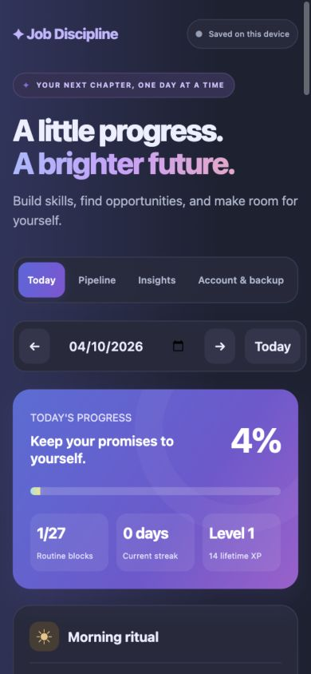

# Job Discipline

A colorful, offline-capable PWA that brings a daily routine, job applications, technical growth, and personal wellbeing into one workspace. Firebase sign-in keeps progress synchronized across devices.



## Features

- A daily dashboard built around the original 27-block routine.
- India, UAE, and Netherlands application counters and portal scan checklists.
- An editable application pipeline: Applied → Interview → Rejected → Offer.
- Networking, referral and cold-email tracking with follow-up dates.
- Seven- and thirty-day statistics, a monthly calendar, streaks, XP and levels.
- Pomodoro/deep-work sessions, phone-usage targets and daily reflection.
- Local persistence, JSON backup/import, and a durable offline sync queue.
- Firebase email/password sign-in and private records for each account.
- Responsive light/dark styling, iPhone installation and offline caching.

## Quick start

Requires Node.js 22 or newer.

```sh
npm ci
npm start
```

Open **http://localhost:8080**. The start command builds the app and serves only the generated `dist/` directory. Do not open `index.html` directly. After editing source files, stop and restart the server to rebuild.

To use another port:

```sh
PORT=8083 npm start
```

## Firebase

The public web configuration for `job-discipline-fa29a` is in `src/config/firebase.js`. Authentication and Firestore rules protect account data; the public web API key is not an Admin SDK credential.

Enable Email/Password authentication and create the default Firestore database in Firebase Console. Then deploy the private rules and application:

```sh
firebase login
npm run deploy
```

The CLI uses the project configured in `.firebaserc`. See [Firebase setup](docs/firebase-setup.md) for details. The live configuration has been checked against Firebase, and the private Firestore rules have been deployed. Creating an app account and publishing the hosting build remain the final production checks.

Sign in inside **Account & backup**. To move previous browser-only progress into your account, choose **Transfer local progress**. Sign in with the same account on your other devices. The header reports saving, synced, offline, and errors.

## Project structure

```text
job-discipline/
├── src/
│   ├── app.js                 # Events, state and timer lifecycle
│   ├── styles.css             # Responsive colorful UI
│   ├── config/firebase.js     # Public Firebase web settings
│   ├── domain/                # Routine and progress calculations
│   ├── services/              # Firebase adapter and merge/queue logic
│   └── ui/views.js            # Dashboard, pipeline, insights and account views
├── public/
│   ├── icons/                 # PWA and iPhone icons
│   ├── manifest.json
│   └── sw.js                  # Service worker build template
├── firebase/firestore.rules   # Account-specific access rules
├── scripts/                   # Production build and local HTTP server
├── tests/                     # Unit and Firebase emulator integration tests
├── docs/                      # Architecture and Firebase instructions
├── .github/workflows/ci.yml    # Formatting, tests and build checks
├── index.html                 # HTML entry template
├── firebase.json              # Hosting and emulator settings
├── .firebaserc                # Default Firebase project
└── package.json
```

`dist/` and `node_modules/` are generated locally and ignored by Git. Old tracker versions, bundled SDK copies, debug logs and obsolete build scripts are no longer part of the source tree. The Firebase browser SDK is bundled from the locked npm dependencies during the build.

## Verification

```sh
npm test
npm run format:check
npm run build
```

Unit tests cover progress, date boundaries, streaks, backups, migration, independent-field merges, offline overlays, queue acknowledgement, deletions, import replacement and shared timer deduplication.

Firebase integration tests run against an isolated local demo project. Install the Firebase CLI and a recent Java runtime, then start the emulators in one terminal:

```sh
firebase emulators:start --only auth,firestore --project demo-job-discipline
```

In another terminal:

```sh
npm run test:firebase
```

They exercise real authentication, two-client live updates, offline replay, local migration, deletions, account isolation, and anonymous/cross-account access rejection.

## Install on iPhone

Deploy the app over HTTPS. Open its URL in Safari → Share → Add to Home Screen. Open once online to cache the app, and sign in from the installed app. Physical iPhone installation remains a device check.

## How progress and syncing work

Routine blocks provide 60% of daily progress. Applications toward 6, outreach toward 5, LeetCode toward 1 and technical hours toward 2 each provide another 10%. Targets are capped. Phone usage, portal scans, reflections and timer minutes are tracked separately.

A streak day reaches 80%. An unfinished today preserves a streak ending yesterday. Each completed block earns 10 XP plus the day's progress score; every 500 XP earns a level. Seven-/thirty-day statistics end on the selected date and count unlogged days as zero.

Daily counters and detailed pipeline/contact records are separate: creating a record does not increment a counter. Stats, calendar, XP and streaks derive from the synchronized records. See [architecture](docs/architecture.md) for conflict handling, offline behavior and storage details.

Timer deadlines persist and are shared across signed-in devices. Completed sessions use a session ID so the same session is counted once. The app must be reopened to process completion; an iPhone may suspend background execution. Phone usage is entered manually. No push notifications or Screen Time integration are implemented.

Export a backup periodically, especially before clearing browser data. Firebase sync is not a substitute for retaining a backup.
