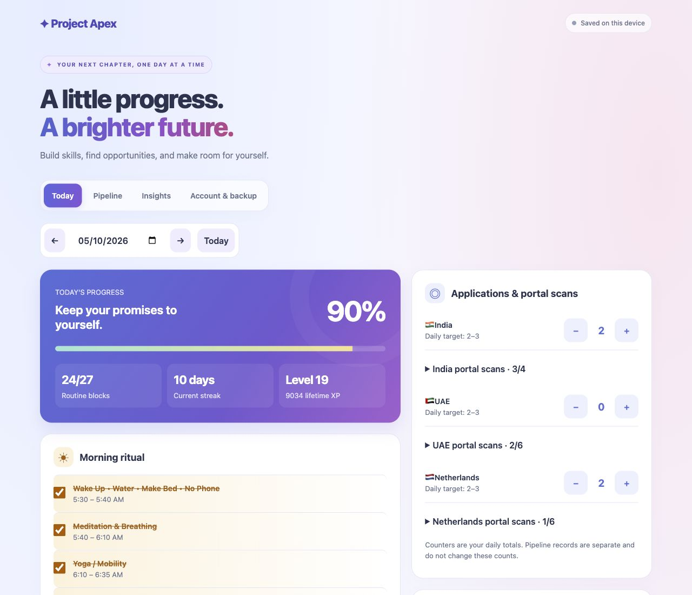
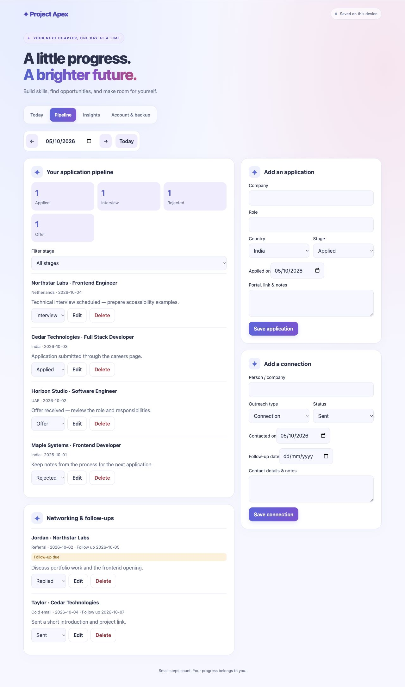
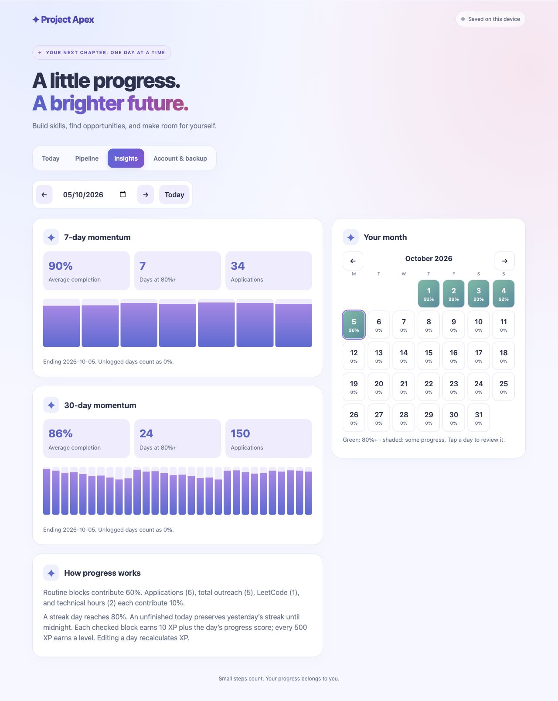
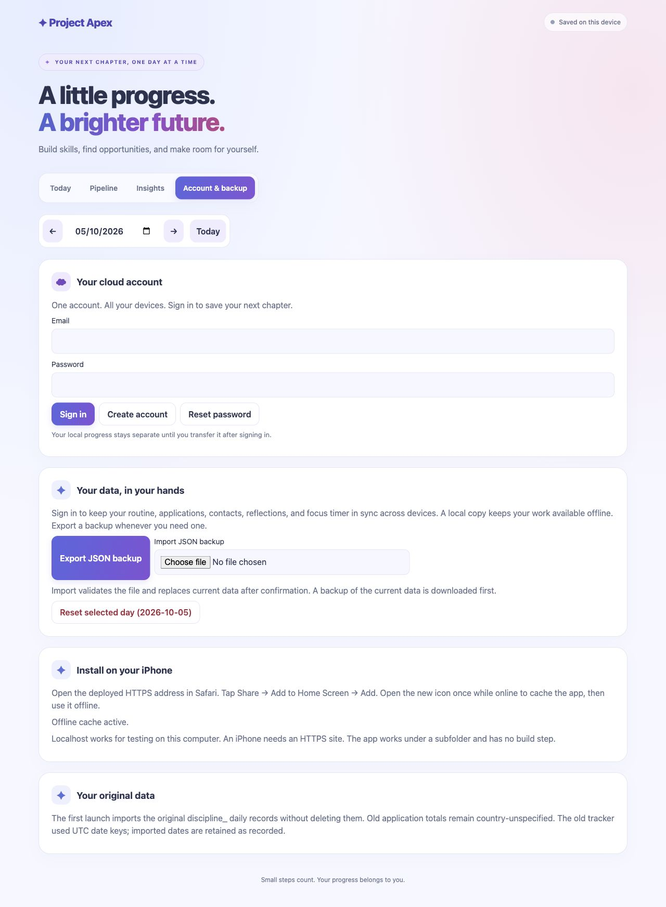
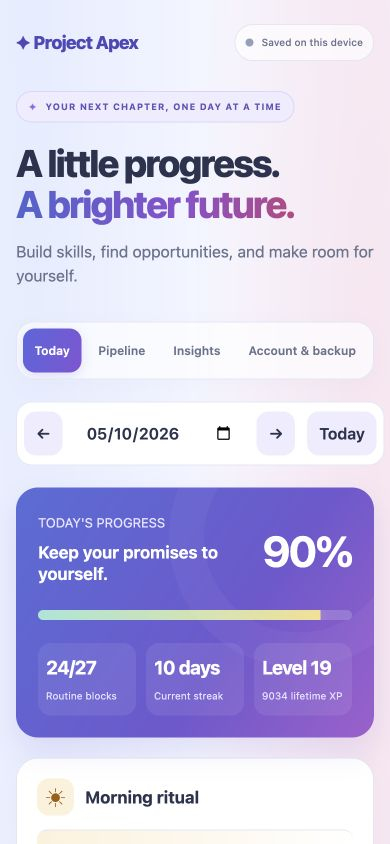

# Project Apex

**Built to solve my own problem: staying consistent through a job search.** Project Apex is my personal workspace for daily routines, applications, networking, and technical growth, accessible from my laptop or an installed iPhone web app.

[](https://github.com/Navaneeth-007/Project_Apex/actions/workflows/ci.yml)


**[Open the live app](https://job-discipline-fa29a.web.app/)** · [Architecture](docs/architecture.md) · [Deployment](docs/firebase-setup.md) · [Contributing](CONTRIBUTING.md)

## Why I built it

During my job search, I wanted one place to manage the work around getting hired: finding relevant roles, tracking applications, following up with people, preparing for interviews, and maintaining a daily routine. I built Project Apex for my own use so those activities could become a clear, repeatable process.

The product reflects that personal need. Country-specific tracking supports my search across India, the UAE, and the Netherlands. Daily checklists and reflections help me decide what to do next, while progress charts make consistency visible. iPhone installation and account sync let me access the same workspace across devices.

## Engineering highlights

- **A personal problem carried through to a deployed product:** a working HTTPS application with an installable mobile experience, documented setup, and a repeatable build and release process.
- **Persistence beyond a happy-path save:** account-specific local caches, a durable pending-write queue, revision-aware acknowledgements, and realtime updates preserve edits through offline periods and reconnects.
- **Explicit handling of concurrent edits:** independent daily fields merge, same-field conflicts use last-write behavior, removals synchronize as tombstones, and shared focus sessions use IDs to prevent double-counting.
- **Privacy enforced at the database boundary:** Firebase Authentication and owner-only Firestore rules isolate accounts; emulator tests check anonymous and cross-account access rejection.
- **Maintainable implementation with focused tests:** rendering, domain calculations, and cloud I/O are separated into modules; unit and Firebase integration tests cover scoring, migration, sync, and isolation, with formatting, unit tests, and build validation in CI.

This project shows how I approach software development: start with a concrete need, make deliberate technical tradeoffs, and build something useful enough to use personally. The [architecture](docs/architecture.md) explains those decisions and their limits.

## Preview

Screenshots show the actual app with fictional companies, contacts, and sample progress in a local guest workspace. No personal account data is pictured.



<details>
<summary><strong>Application pipeline and networking</strong></summary>

Manage Applied, Interview, Rejected, and Offer stages alongside referral and cold-email follow-ups.



</details>

<details>
<summary><strong>Productivity insights and calendar</strong></summary>

Review seven- and thirty-day momentum, application totals, and completion by day.



</details>

<details>
<summary><strong>Account, backups, and installation</strong></summary>

Use an account for cross-device sync, export your data, and install from Safari.



</details>

<details>
<summary><strong>Mobile dashboard</strong></summary>



</details>

## What you can do

| Area                | Features                                                                         |
| ------------------- | -------------------------------------------------------------------------------- |
| Daily routine       | 27 timed blocks, checkboxes, date navigation, and weighted completion            |
| Job search          | India, UAE, and Netherlands counters and portal scan checklists                  |
| Applications        | Editable records, stage filtering, notes, and application dates                  |
| Networking          | Connections, referrals, cold emails, statuses, and follow-up dates               |
| Momentum            | 7/30-day charts, monthly calendar, streaks, XP, and levels                       |
| Focus and wellbeing | 25/50-minute focus sessions, 5-minute breaks, phone-use targets, reflections     |
| Data ownership      | Local guest mode, account sync, JSON export/import, and explicit guest migration |
| Installation        | HTTPS hosting, web app manifest, home-screen icons, and offline app shell        |

## Run locally

Requires **Node.js 22+** and npm.

```sh
git clone https://github.com/Navaneeth-007/Project_Apex.git
cd Project_Apex
npm ci
npm start
```

Open [localhost:8080](http://localhost:8080). `npm start` builds the app and serves the generated `dist/` directory. Restart after source changes; there is no development hot-reload server. For a different port, use `PORT=8083 npm start`.

Guest tracking works without signing in. This repository contains the public Firebase web configuration for the live project. **For your own cloud deployment, configure your own Firebase project** using the [setup guide](docs/firebase-setup.md).

## Use on iPhone

1. Open [the live app](https://job-discipline-fa29a.web.app/) in Safari.
2. Tap **Share → Add to Home Screen → Add**.
3. Open the new icon once while online to cache the app shell.
4. Sign in under **Account & backup** using the same account on each device.
5. If you have browser-only progress, choose **Transfer local progress** from that original workspace after signing in.

The installed label retains Job Discipline's existing metadata. Safari and the installed app can have separate local storage; sign in inside the installed app to access cloud records.

## Technology and design

Project Apex is the public showcase name and webpage header. The package, Firebase project, storage keys, document schema, and installed app metadata retain the internal **Job Discipline** identity for compatibility.

The UI uses semantic HTML, CSS, and JavaScript ES modules. **esbuild** bundles the app and Firebase browser SDK; **Firebase Authentication** handles email/password accounts, **Cloud Firestore** stores private records, and **Firebase Hosting** serves the static HTTPS build. A generated service worker caches the app shell, while the app journals pending account edits in local storage.

Pure domain and sync functions stay separate from rendering and Firebase I/O. No framework, application server, or Cloud Functions are required. Read the [architecture and data model](docs/architecture.md) for the tradeoffs and conflict behavior.

```text
.
├── src/
│   ├── app.js                  # State, events, backups, timer lifecycle
│   ├── styles.css              # Responsive light/dark UI
│   ├── config/firebase.js      # Public Firebase web configuration
│   ├── domain/                 # Routine, scoring, validation, migration
│   ├── services/               # Auth, Firestore, merge logic, save queue
│   └── ui/views.js             # Today, pipeline, insights, account views
├── public/                     # Manifest, icons, service worker template
├── firebase/firestore.rules    # Owner-only access and record validation
├── scripts/                    # Build and local static server
├── tests/                      # Unit and emulator integration tests
├── docs/                       # Design, operations, testing, screenshots
├── .github/                    # CI and issue/PR templates
├── index.html                  # HTML entry template
├── firebase.json               # Hosting and emulator configuration
├── .firebaserc                 # Default Firebase project
└── package.json
```

`dist/`, `node_modules/`, emulator state, debug logs, and personal backups are ignored. Only `dist/` is published to Hosting.

## Checks and deployment

```sh
npm run format:check
npm test
npm run build
```

GitHub Actions runs these checks on pushes and pull requests with a locked dependency install. The suite has **12 unit tests** and **2 additional Firebase emulator integration tests**. Emulator tests cover actual rule enforcement, authentication, two-client updates, offline replay, migration, deletion, and account isolation. They run separately; see [testing](docs/testing.md).

To deploy your configured Firebase project:

```sh
firebase login
npm run deploy
```

The command builds and deploys both Firestore rules and Hosting. There is no automatic production deployment on push. See [deployment and rollback](docs/firebase-setup.md) before publishing changes.

## Progress rules

Routine blocks contribute **60%**. Applications toward 6, total outreach toward 5, LeetCode toward 1, and technical hours toward 2 each contribute **10%**; each contribution is capped. Portal scans, phone usage, reflections, and timer minutes are tracked separately.

A streak day reaches 80%. An unfinished today preserves a streak ending yesterday. Each checked routine block contributes 10 XP plus the day's progress score; every 500 XP adds a level. Stats end on the selected date, and unlogged days count as zero. Pipeline records do not increment daily counters.

## Practical limits

- Different daily fields merge independently; concurrent edits to the same field use the last server write. Counters are not additive across devices.
- Account records are loaded together. This design suits a personal tracker rather than a large shared workspace.
- Background timer alarms are not guaranteed on iOS. Completion is processed when the app runs again.
- Phone usage is entered manually. Push reminders and Screen Time integration are not implemented.
- Browser data can be cleared by the user or platform. Keep JSON backups, especially before clearing storage.

See [security and privacy](SECURITY.md) for account isolation, local copies, and responsible reporting; see [contributing](CONTRIBUTING.md) for development conventions. No project license has been selected; this repository does not grant an open-source license.
