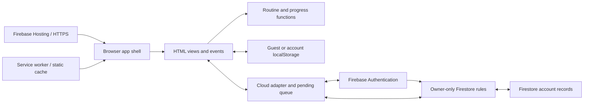
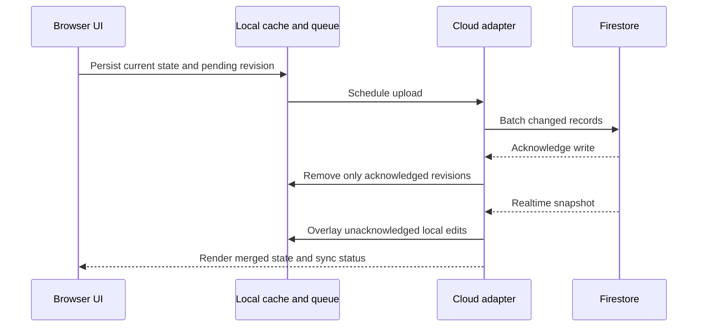

# Architecture

Project Apex is a static browser application with the internal Job Discipline identity. Firebase Hosting delivers the built app, Authentication identifies users, and Firestore stores their records. Guest tracking works locally without a backend account.

## System overview



## Module boundaries

| Module                         | Responsibility                                                                    |
| ------------------------------ | --------------------------------------------------------------------------------- |
| `src/app.js`                   | Event delegation, selected view/date, state changes, backup flow, timer lifecycle |
| `src/ui/views.js`              | Escaped HTML templates with current state supplied by getters                     |
| `src/styles.css`               | Responsive layouts, color tokens, component styling, system dark mode             |
| `src/domain/core.js`           | Defaults, local date keys, scoring, streaks, backup validation, migration         |
| `src/domain/routine.js`        | Original 27 routine blocks                                                        |
| `src/services/sync-core.js`    | Pure record diffing, merge, queue coalescing, revision acknowledgement            |
| `src/services/cloud.js`        | Auth lifecycle, account caches, realtime listener, queue upload, retry            |
| `src/services/firebase-sdk.js` | Firebase SDK exports used by the browser bundle                                   |
| `src/config/firebase.js`       | Public project settings and local emulator switch                                 |

Views read current state; event handlers mutate it and persist changes. Domain and sync helpers do not depend on the DOM or live Firebase services, so Node tests exercise them directly.

## Data model

The local backup schema is version 3:

```text
version: 3
days: { "YYYY-MM-DD": dailyRecord }
applications: [applicationRecord]
contacts: [contactRecord]
timer: currentSession | null
```

Date keys use the browser's local calendar date. Legacy imported UTC date keys are retained as originally recorded. Imports validate records and discard an active timer to avoid resuming a stale session.

Firestore stores envelopes at **`users/{uid}/records/{recordId}`**:

| Field       | Purpose                                                  |
| ----------- | -------------------------------------------------------- |
| `kind`      | `day`, `application`, `contact`, or `timer`              |
| `key`       | Local date, record ID, or `current` for the shared timer |
| `data`      | The record payload for a live record                     |
| `deleted`   | Tombstone marker for synchronized removal                |
| `updatedAt` | Server timestamp required by the rules                   |

Daily payloads contain task/portal maps, counters, reflections, phone-use values, score, and focus-session entries. Applications hold company, role, country, stage, date, and notes. Contacts hold person/company, outreach type, status, contacted date, follow-up date, and notes. Stats, streaks, and XP are computed from records rather than stored separately.

## Save and sync lifecycle



Edits remain available locally before upload. Pending writes are coalesced by record and uploaded in batches of at most 400. A newer edit made while a batch is uploading retains its own revision and stays queued. Realtime snapshots are overlaid with pending edits so incoming data does not erase unsynced work. Retry and online reconnection resume syncing; the header exposes pending, offline, synced, and error states.

Guest data uses `job-discipline-v3`. Each account has its own cache and pending queue. Signing out returns to the guest workspace and is blocked while pending edits remain. Local account caches remain on the device for offline access.

Guest migration is explicit: **Transfer local progress** adds missing records; existing cloud records win. It does not automatically upload all local data on sign-in.

## Conflict semantics

| Situation                                     | Result                                                          |
| --------------------------------------------- | --------------------------------------------------------------- |
| Two devices edit different daily fields       | Independent field patches merge                                 |
| Two devices edit the same daily field/counter | Last server write wins; counters are not additive               |
| Two devices edit an application/contact       | Whole-record last-write behavior                                |
| Day reset or record removal                   | Tombstone propagates to other devices                           |
| Backup import                                 | Explicit replacement semantics, including removed sparse fields |
| Shared focus session completes on two devices | Session ID deduplicates credited focus minutes                  |

Tombstones preserve deletion intent during normal replay. They do not provide conflict history or an interactive resolution interface. Focus entries use session IDs; legacy focus minutes stay separate for compatibility.

## Security boundary

Rules authorize only `request.auth.uid == uid` at the account path. Anonymous and cross-account requests are denied, direct document deletion is denied, and allowed writes validate envelope fields and selected payload constraints. All other paths are denied.

Day payload validation is intentionally less strict than application/contact validation; nested daily values are also checked by application import logic. Client validation is not a substitute for stronger server-side schema checks if this grows into a shared product. See [security and privacy](../SECURITY.md).

## Build and offline behavior

`npm run build` uses esbuild to produce minified ES modules, split Firebase chunks, and CSS. It copies `public/` and `index.html` into disposable `dist/`, generates a precache list, and derives the service worker version from built content.

The worker caches only known static assets from this app. It uses network-first requests with cached fallback and does not cache Firebase API responses. Account edits rely on the app's durable pending queue. First-time account sign-in requires a connection; opening the app offline requires a previously cached shell.

New workers wait for older app windows to close. Reopen online to activate an update. `index.html` and `sw.js` have `no-cache` Hosting headers. Source, tests, documentation, and dependencies are outside the published directory.

## Tradeoffs

All account records are loaded together; the model suits personal use. A larger product would need pagination, retention limits for tombstones, stronger nested schema validation, and explicit conflict resolution. Timers depend on the wall clock and app execution; iOS can suspend the app. There is no backend scheduler, push notification service, or phone Screen Time integration.
